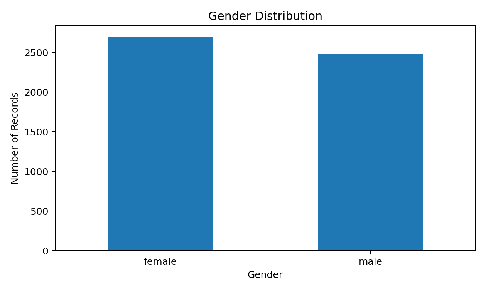
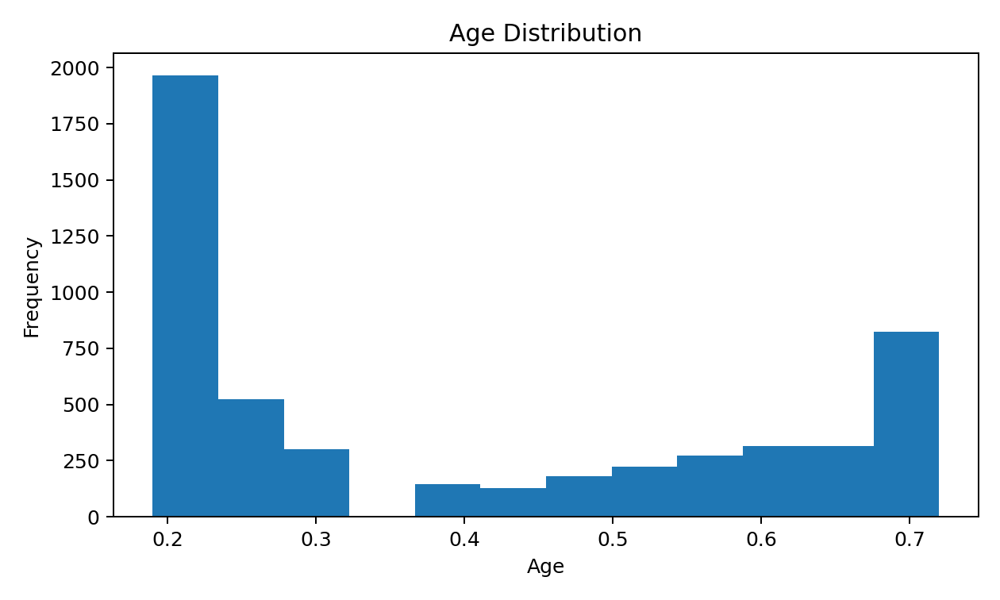
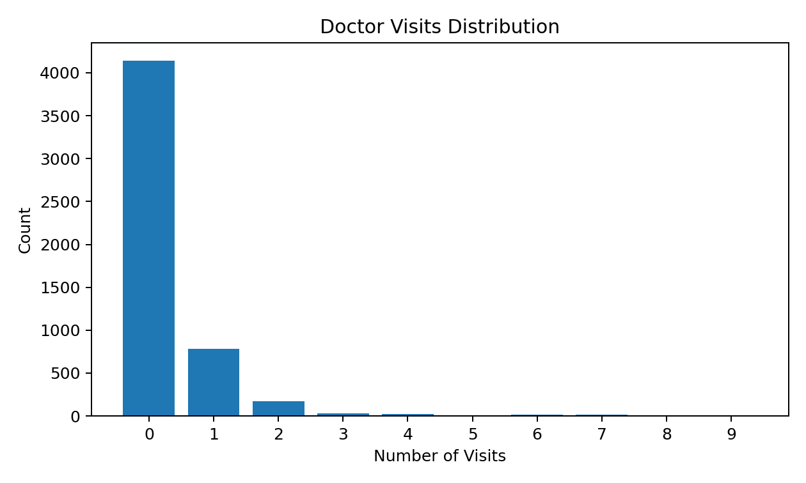
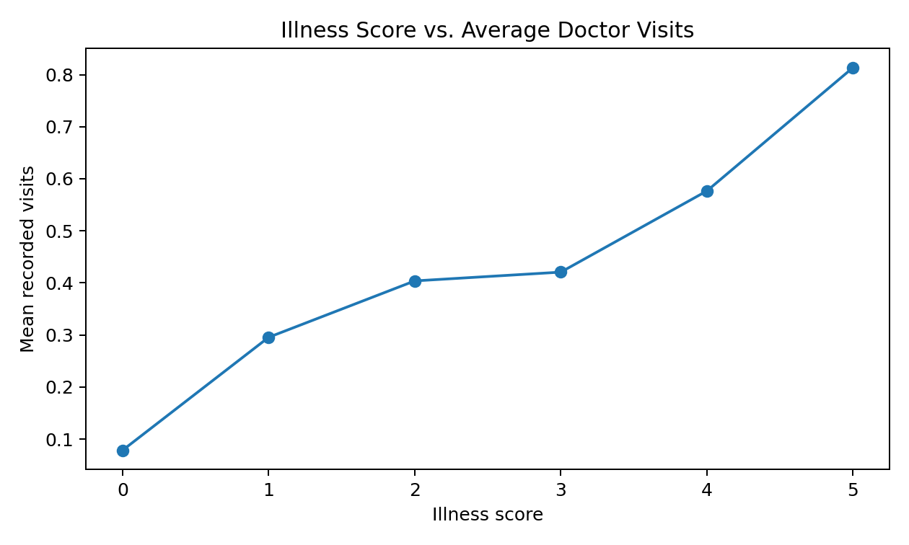
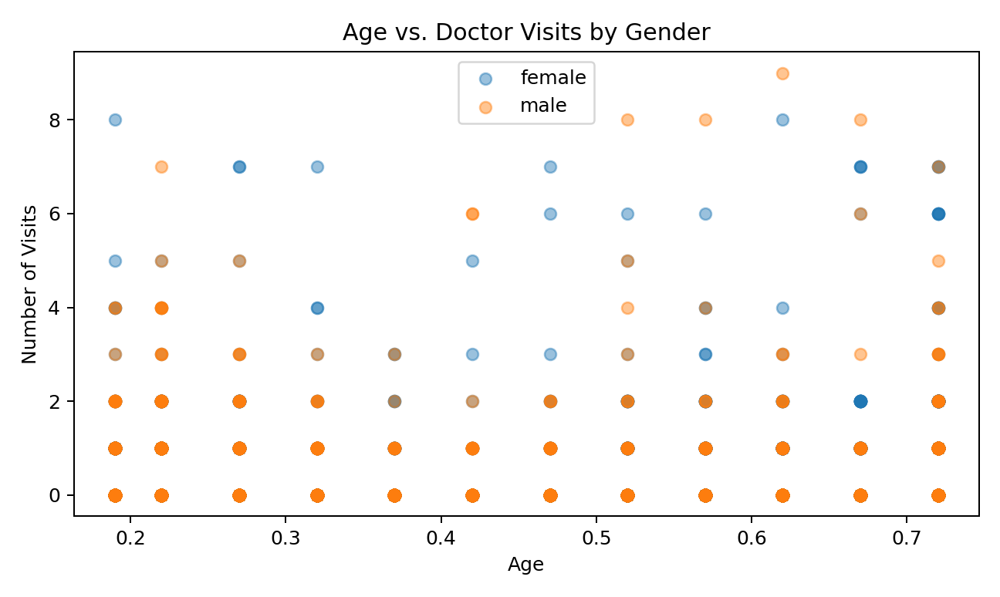

# 🏥 Healthcare Analytics for Doctor Visits

An exploratory data analysis project focused on understanding doctor visits through patient demographics, illness levels, age, gender, and healthcare-related indicators.

The project uses Python to clean, inspect, analyze, and visualize a healthcare dataset containing **5,190 patient records and 13 variables**.

---

## 📌 Project Overview

Healthcare data can reveal useful patterns about how different demographic and health-related factors are associated with doctor visits.

This project performs Exploratory Data Analysis (EDA) to answer questions such as:

- What does the gender distribution look like?
- How is age distributed across the dataset?
- How frequently do patients visit doctors?
- How do doctor visits differ by gender?
- Is there a relationship between illness level and doctor visits?
- How are age and doctor visits distributed across genders?

---

## 🎯 Objectives

- Understand the structure and quality of the healthcare dataset.
- Perform basic data inspection and statistical analysis.
- Check the dataset for missing values.
- Explore patient demographics.
- Analyze doctor-visit patterns.
- Visualize relationships between age, gender, illness, and visits.
- Present the findings through clear and easy-to-understand charts.

---

## 📂 Dataset

The dataset contains **5,190 records** and **13 columns**.

### Main Variables

| Column | Description |
|---|---|
| `visits` | Number of recorded doctor visits |
| `gender` | Patient gender |
| `age` | Age-related numeric value in the source dataset |
| `income` | Income-related numeric variable |
| `illness` | Illness score/count |
| `reduced` | Indicator related to reduced activity |
| `health` | Health-related numeric measure |
| `private` | Private healthcare/insurance indicator |
| `freepoor` | Free/poor healthcare indicator |
| `freerepat` | Free/repatriation healthcare indicator |
| `nchronic` | Indicator for chronic condition |
| `lchronic` | Indicator for long-term chronic condition |

---

## 🛠️ Technologies Used

- 🐍 Python
- 🐼 Pandas
- 🔢 NumPy
- 📊 Matplotlib
- 🎨 Seaborn
- 📓 Jupyter Notebook

---

## 🔎 Analysis Performed

### 1. Data Inspection

The project starts with basic dataset exploration:

- First 5 records
- Last 5 records
- Dataset shape
- Data types and information
- Descriptive statistics
- Missing-value check

### 2. Univariate Analysis

Individual variables are analyzed to understand their distributions:

- Gender distribution
- Age distribution
- Doctor visits distribution

### 3. Multivariate Analysis

Relationships between multiple variables are explored:

- Average doctor visits by gender
- Illness score vs. average doctor visits
- Distribution of visits by gender
- Age vs. doctor visits, separated by gender

---

# 📊 Visualizations

## Gender Distribution



## Age Distribution



## Doctor Visits Distribution



## Illness Score vs. Average Doctor Visits



## Age vs. Doctor Visits by Gender



---

## 📈 Key Observations

Based on the analysis performed in the notebook:

- The dataset contains **5,190 patient records**.
- The dataset includes both demographic and healthcare-related variables.
- Female records represent approximately **52.1%** of the dataset, while male records represent approximately **47.9%**.
- The recorded doctor-visit variable ranges from **0 to 9 visits**.
- The analysis shows different average recorded visit levels between male and female groups.
- Average recorded doctor visits increase across the illness-score groups in this dataset.
- Age, gender, illness, and doctor visits can be explored together to identify patterns in healthcare utilization.

> Note: These are descriptive observations from this dataset and should not be interpreted as clinical conclusions or medical recommendations.

---

## 📓 Project Notebook

The complete analysis is available in the Jupyter Notebook:

`Healthcare_Analytics_for_Doctor_Visits.ipynb`

The notebook contains the complete Python workflow, including:

```text
Data Loading
     ↓
Data Inspection
     ↓
Data Cleaning / Null Check
     ↓
Statistical Analysis
     ↓
Univariate Analysis
     ↓
Multivariate Analysis
     ↓
Data Visualization
     ↓
Insights
```

---

## 🚀 How to Run

### 1. Clone the repository

```bash
git clone https://github.com/blackshadowog/Healthcare-Analytics-for-Doctor-Visits.git
cd Healthcare-Analytics-for-Doctor-Visits
```

### 2. Install dependencies

```bash
pip install pandas numpy matplotlib seaborn jupyter
```

### 3. Start Jupyter Notebook

```bash
jupyter notebook
```

Open the project notebook and run the cells.

---

## 📁 Project Structure

```text
Healthcare-Analytics-for-Doctor-Visits/
│
├── Healthcare_Analytics_for_Doctor_Visits.ipynb
├── 1776250375-P2-Healthcare Analytics for Doctor Visits (1).csv
├── images/
│   ├── gender_distribution.png
│   ├── age_distribution.png
│   ├── visits_distribution.png
│   ├── illness_vs_visits.png
│   └── age_vs_visits_gender.png
│
└── README.md
```

---

## 💡 Skills Demonstrated

- Data Analysis
- Exploratory Data Analysis (EDA)
- Data Cleaning
- Data Validation
- Statistical Analysis
- Data Visualization
- Pandas
- NumPy
- Matplotlib
- Seaborn
- Jupyter Notebook
- Healthcare Data Analytics

---

## 🔗 Demo / Source Code

### GitHub Repository

👉 https://github.com/blackshadowog/Healthcare-Analytics-for-Doctor-Visits

---

## 👨‍💻 Author

**Abhishek Kumar Tiwari**

Data Analyst | Python Developer

---

⭐ If you found this project useful, feel free to explore the repository and leave a star!
